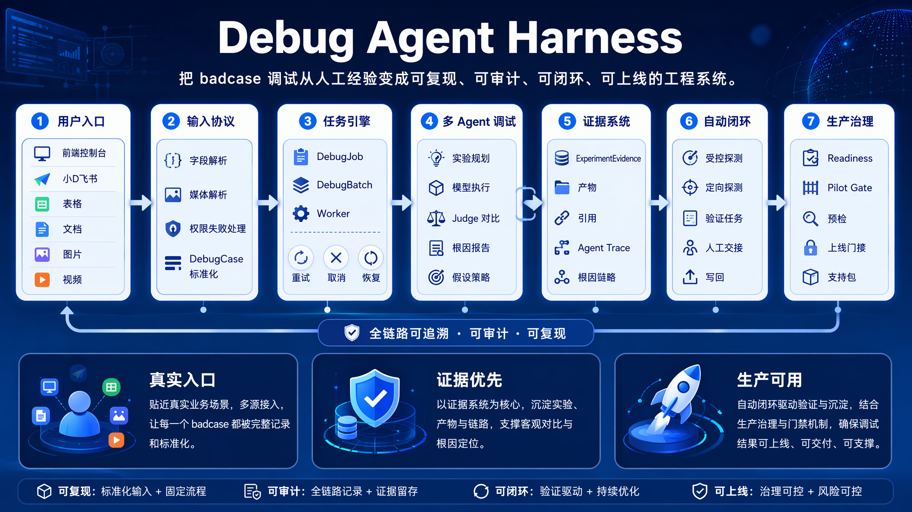

# Debug Agent Harness

Debug Agent 是一个面向多模态 badcase 的全流程调试 Agent Harness。这个项目的核心成果，是把原本依赖人工经验、分散在表格/文档/飞书/本地样本里的 badcase 调试流程，工程化为一套**可接入、可执行、可审计、可闭环、可上线**的 Debug Agent 系统。

你在这个项目里完成的不是一个单点 OCR 脚本，也不是只会调用模型接口的聊天壳，而是搭建了一条完整链路：从真实用户入口收集 badcase，将输入标准化为 `DebugCase`，通过 `DebugJob` / `DebugBatch` 和异步 Worker 执行调试，再由多 Agent 协作完成实验规划、模型复跑、Judge 对比、证据沉淀、根因归因、自动闭环、写回确认和生产门禁。

项目已经具备后端 API、前端控制台、小D飞书长连接、异步任务引擎、报告生成、RAG 知识库、DebugLesson 沉淀、写回确认、运维预检和 Pilot Gate 等完整工程能力。

## 项目定位

Debug Agent 服务于评测、算法、质量、运营和项目协作场景，解决多模态模型 badcase 调试过程中的几个核心问题：样本入口分散、调试过程不可复现、证据不透明、根因结论不可审计、报告不可读、经验无法沉淀、写回动作缺少确认链路。

项目的核心原则是证据优先、透明闭环、操作可控、真实入口和持续学习。没有证据支撑时，系统不会声称找到根因；证据耗尽时，会明确说明停止原因、已审阅证据、缺失证据和下一步建议。

## Harness 分层架构

### 1. 输入协议层

输入协议层把不同来源的 badcase 统一整理为 `DebugCase`。当前支持 JSONL、CSV、飞书表格行、飞书链接、Base 记录、文档、附件、图片、视频等入口，并处理字段别名、缺失字段、媒体解析、权限失败和表格行定位。

关键实现包括 `backend/src/debug_agent/api/import_routes.py`、`backend/src/debug_agent/api/badcase_intake_parsers.py`、`backend/src/debug_agent/imports/` 和 `backend/src/debug_agent/cases/models.py`。

### 2. 任务状态机层

任务状态机层负责把 `DebugCase` 转成 `DebugJob` 或 `DebugBatch`，并管理 `created`、`running`、`completed`、`failed`、`cancelled` 等状态。它支持 attempt 记录、自动重试、stale running job 恢复、batch 进度统计、运行阶段持久化和 worker 并发控制。

关键实现包括 `backend/src/debug_agent/jobs/service.py`、`backend/src/debug_agent/jobs/worker.py` 和 `backend/src/debug_agent/storage/repository.py`。

### 3. Agent 编排层

Agent 编排层通过多角色协作完成调试，而不是把所有逻辑压进一个 Agent。当前链路包含实验规划、模型执行、确定性 judge、报告根因 Agent、实验规划 Agent、Judge Comparator Agent、Hypothesis Strategist、写回 Operator 等角色。

关键实现包括 `backend/src/debug_agent/experiments/planner.py`、`backend/src/debug_agent/experiments/runner.py`、`backend/src/debug_agent/recipes/`、`backend/src/debug_agent/reports/meta_agents.py`、`backend/src/debug_agent/debug_closure/` 和 `backend/src/debug_agent/orchestration/`。

### 4. 证据可信度层

证据可信度层要求每次模型调用、解析、judge、artifact、引用和 Agent 输出都有可追踪记录。`ExperimentEvidence` 会记录 step、trial、模型信息、usage、latency、request summary、raw output、parse error、judge 结果和 artifacts。报告侧会生成 citations、root cause trace、agent traces 和 evidence ledger。

关键实现包括 `backend/src/debug_agent/experiments/runner.py`、`backend/src/debug_agent/reports/generator.py`、`backend/src/debug_agent/reports/citations.py`、`backend/src/debug_agent/reports/root_cause_trace.py`、`backend/src/debug_agent/reports/agent_traces.py` 和 `backend/src/debug_agent/artifacts/`。

### 5. 闭环动作层

闭环动作层负责在首轮报告之后继续推进验证，而不是止步于“生成报告”。它支持 hypothesis loop、controlled probe、targeted probe、strategy follow-up、recommended action verification、human handoff、final attribution、自动闭环报告和表格/Base 写回。

关键实现包括 `backend/src/debug_agent/jobs/auto_closure.py`、`backend/src/debug_agent/debug_closure/`、`backend/src/debug_agent/reports/recommended_actions.py`、`backend/src/debug_agent/reports/followups.py` 和 `backend/src/debug_agent/api/lark_pending_command_execution.py`。

### 6. 安全确认层

安全确认层用于约束写风险操作。创建任务、批量调试、表格同步、表格写回、Base 写回、Worker 控制等动作可以通过 pending command、writeback confirmation、TTL、actor、audit、dry run 和显式确认机制完成，避免在没有用户确认和持久状态的情况下执行写操作。

关键实现包括 `backend/src/debug_agent/api/writeback_routes.py`、`backend/src/debug_agent/api/lark_pending_command_controller.py`、`backend/src/debug_agent/api/lark_pending_command_execution.py`、`backend/src/debug_agent/storage/lark_pending_repository.py` 和 `backend/src/debug_agent/storage/lark_writeback_repository.py`。

### 7. 生产门禁层

生产门禁层用于支撑 production-candidate 和 dogfood。它包含 readiness、pilot gate、artifact retention、support bundle、database backup、Lark bot preflight、permission checklist、setup package、go-live gate 和 setup acknowledgement。

关键实现包括 `backend/src/debug_agent/api/operations_routes.py`、`backend/src/debug_agent/api/operations_status_controller.py`、`backend/src/debug_agent/api/lark_bot_setup_controller.py` 和 `docs/operations/production-runbook.md`。

## 端到端链路

用户可以从前端控制台或小D飞书入口提交 badcase。系统先完成输入解析和字段补齐，再创建 `DebugJob` 或 `DebugBatch`。Worker 认领任务后，调用 recipe 生成实验计划，通过模型适配器执行实验，并使用确定性 judge 生成 evidence。报告模块基于 evidence 生成初始报告、root cause trace、recommended actions 和 agent traces。随后自动闭环模块可以继续生成 hypothesis、controlled probe、targeted probe、verification job 和 writeback decision。最终结果可以展示在前端、通过小D回复、写回飞书表格/Base，或导出为运维 support bundle。

## 主要能力

| 能力域 | 当前实现 |
| --- | --- |
| 输入接入 | JSONL、CSV、Spreadsheet rows、飞书链接、Base、文档、附件、图片、视频 |
| 样本模型 | `DebugCase` 支持 task type、prompt、golden answer、expected output、output schema、scoring standard、prediction、box region |
| 任务执行 | `DebugJob`、`DebugBatch`、worker 队列、并发控制、重试、取消、stale recovery |
| 实验规划 | recipe-driven experiment plan、baseline trials、ablation variant、targeted probe、strategy follow-up |
| 模型适配 | fake adapter、Ark Seed2 Lite、Ark Seed2 Pro、Ark Video，支持按 Agent role 路由模型配置 |
| 证据链 | `ExperimentEvidence`、artifact store、evidence ledger、citations、root cause trace、agent trace |
| 报告生成 | 初始报告、meta agent enrichment、recommended actions、confidence reasons、飞书 Docx 渲染 |
| 自动闭环 | hypothesis loop、controlled probe、causal comparison、verified root cause、evidence exhausted stop |
| 飞书集成 | 小D长连接、命令预览、pending command、卡片/回复、权限预检、表格同步和写回 |
| 运维治理 | readiness、pilot gate、performance summary、support bundle、artifact retention、database backup |

## 仓库结构

```text
debug_agent/
├── backend/                         # FastAPI 后端、任务服务、Agent 编排、RAG、存储和飞书集成
│   ├── pyproject.toml                # Python 3.11 依赖、pytest、ruff、mypy 配置
│   └── src/debug_agent/
│       ├── api/                      # HTTP 路由、运行时组装、运维和小D控制器
│       ├── assistant/                # 项目助手、RAG 知识库、静态手册和 DebugLesson
│       ├── artifacts/                # evidence artifact、图片裁剪、视频片段和文件快照
│       ├── cases/                    # DebugCase、输出解析和答案比较
│       ├── debug_closure/            # hypothesis loop、controlled probe 和 causal comparison
│       ├── experiments/              # 实验计划与模型运行
│       ├── imports/                  # CSV、JSONL、Spreadsheet 行导入
│       ├── jobs/                     # DebugJobService、Worker、自动闭环
│       ├── lark/                     # 飞书 connector、小D命令解析和回复 payload
│       ├── models/                   # fake/Ark 模型适配器和模型路由
│       ├── recipes/                  # handwriting OCR、分类、图片/视频/多模态检测 recipe
│       ├── reports/                  # 报告、引用、根因链路、recommended actions 和 Docx 渲染
│       ├── spreadsheets/             # 飞书表格同步、重跑、写回和审计
│       ├── storage/                  # SQLite schema、repository、pending/writeback/action 状态
│       ├── telemetry/                # API 和运行性能记录
│       └── xiaod/                    # 小D语义 brain、handler、presenter 和 service
├── frontend/                         # React + Vite + TypeScript 前端控制台
│   └── src/
│       ├── api/                      # API client 和类型
│       ├── app/                      # 主应用、轮询、操作动作和布局
│       ├── assistant/                # 悬浮助手
│       ├── cases/                    # 样本列表和详情
│       ├── imports/                  # JSONL/CSV/Spreadsheet 导入 UI
│       ├── jobs/                     # Worker、Job、Batch 面板
│       ├── observability/            # readiness、pilot gate、bot preflight 等运维面板
│       ├── reports/                  # 调试报告工作区
│       └── spreadsheets/             # 表格同步、写回、审计和权限修复 UI
├── docs/operations/                  # production runbook、pilot 模板、小D协议和权限清单
├── scripts/                          # Worker、Lark consumer、preflight、pilot validation、PowerShell 启动脚本
├── docker-compose.yml                # backend、worker、frontend、lark-bot-consumer 编排
├── Dockerfile.lark-consumer          # 小D长连接 consumer 镜像
├── Makefile                          # test、lint、typecheck、dev 命令入口
└── .env.example                      # 本地和 Docker 配置模板
```

## 运行服务

| 服务 | 说明 | 入口 |
| --- | --- | --- |
| `backend` | FastAPI API 服务 | `debug_agent.main:app`，默认 `http://localhost:8000` |
| `worker` | 异步 DebugJob Worker | `scripts/run_debug_agent_worker.py` |
| `frontend` | React/Vite 前端，由 nginx 托管并反代后端 | 默认 `http://localhost:8080` |
| `lark-bot-consumer` | 可选小D飞书长连接 consumer | `scripts/lark_bot_long_connection_consumer.py` |

## 快速启动

先复制配置文件，并只在本地 `.env` 或正式 secret storage 中保存真实密钥。

```powershell
cp .env.example .env
```

启动基础服务：

```powershell
docker compose up -d --build backend worker frontend
docker compose ps
curl.exe http://localhost:8080/health
curl.exe http://localhost:8080/api/assistant/knowledge/status
curl.exe http://localhost:8000/api/operations/readiness
```

需要接入真实小D飞书长连接时，再启动 lark profile：

```powershell
docker compose --profile lark up -d --build lark-bot-consumer
docker compose logs -f lark-bot-consumer
```

正常重启不要执行 `docker compose down -v`，该命令会删除 `backend_artifacts` volume，导致 SQLite 数据库、RAG 向量索引、DebugLesson 历史、运行产物和报告被清空。

## 本地开发命令

命令入口以 `Makefile` 为准：

```powershell
make test
make lint
make typecheck
make dev
```

后端依赖和检查配置位于 `backend/pyproject.toml`，前端依赖和脚本位于 `frontend/package.json`。

后端常用命令：

```powershell
cd backend
python -m ruff check src tests
python -m mypy src
python -m pytest -q
```

前端常用命令：

```powershell
cd frontend
npx --yes pnpm@9.15.4 test -- --run
npx --yes pnpm@9.15.4 lint
npx --yes pnpm@9.15.4 typecheck
```

## 关键配置

配置模板位于 `.env.example`。核心配置包括：

| 配置 | 作用 |
| --- | --- |
| `DEBUG_AGENT_DATABASE_URL` | 主数据库连接，默认 SQLite |
| `DEBUG_AGENT_IMAGE_ARTIFACT_DIR` | 运行产物和报告产物目录 |
| `DEBUG_AGENT_REPORT_BASE_URL` | 报告和写回链接基地址 |
| `DEBUG_AGENT_AUTO_WRITEBACK_ENABLED` | 是否允许自动写回 |
| `DEBUG_AGENT_AUTO_CLOSURE_ENABLED` | 是否启用自动闭环 |
| `DEBUG_AGENT_REQUIRE_TRUSTED_ACTOR` | 写风险动作是否要求可信 actor |
| `DEBUG_AGENT_USAGE_BUDGET_UNITS` | live model 使用预算 |
| `DEBUG_AGENT_ENFORCE_USAGE_BUDGET` | 是否强制预算限制 |
| `DEBUG_AGENT_QUEUE_MAX_CONCURRENCY` | Worker 并发数 |
| `DEBUG_AGENT_RETRY_MAX_ATTEMPTS` | Job 最大尝试次数 |
| `DEBUG_AGENT_STALE_RUNNING_JOB_SECONDS` | running job stale recovery 窗口 |
| `DEBUG_AGENT_MODEL_PROVIDER` | 模型 provider，如 `fake`、`ark-seed2-lite`、`ark-seed2-pro`、`ark-video` |
| `ARK_API_KEY`、`ARK_*_MODEL_ID` | Ark 模型调用配置 |
| `LARK_EVENT_MODE` | 小D事件模式，推荐 `long_connection` |
| `LARK_CLI_IDENTITY`、`LARK_CLI_PROFILE` | 飞书 CLI 身份和 profile |
| `LARK_APP_ID`、`LARK_APP_SECRET` | SDK 长连接 consumer 所需飞书 app 凭据 |

## RAG 知识库与 DebugLesson

项目内置 10 份静态知识文档，位于 `backend/src/debug_agent/assistant/knowledge/`。RAG 使用 SQLite 持久化文档、chunk 和 DebugLesson，默认 embedding provider 是确定性的 `local-hash-v1`，便于离线测试和复现。

知识库能力包括项目问答、手册检索、调试规划增强和历史 DebugLesson 复用。RAG 可以增强解释和规划，但不能替代当前任务证据。

常用检查：

```powershell
curl.exe http://localhost:8080/api/assistant/knowledge/status
```

## 小D飞书入口

小D是项目的真实用户入口之一。推荐使用飞书长连接：

```env
LARK_EVENT_MODE=long_connection
LARK_CLI_IDENTITY=bot
LARK_CLI_PROFILE=xiaoD
DEBUG_AGENT_AUTO_WRITEBACK_ENABLED=0
```

真实 dogfood 前需要完成 `GET /api/lark/bot/preflight`、`GET /api/lark/bot/permission-checklist`、`GET /api/lark/bot/setup-package.zip`、人工 setup acknowledgement 和 `GET /api/lark/bot/go-live-gate`。写风险命令必须进入 pending command 或 writeback confirmation 流程，不应通过终端直接调用 confirm/writeback API 来模拟用户路径。

支持的命令示例包括：

```text
/debug help
/debug status
/debug pilot-gate
/debug job <job_id>
/debug batch <batch_id>
/debug run case <case_id>
/debug batch run case-a,case-b
```

## 报告和证据链

最终报告围绕 evidence 而不是主观判断组织内容，至少覆盖原始 case、观察到的失败现象、run stages、evidence ledger、root cause candidates、controlled probe、causal comparison、recommended actions、human handoff、writeback decision、audit 状态、证据边界、停止原因和缺失证据。

如果没有 supported root cause，正确结论是 `stopped_evidence_exhausted`，并说明已审阅证据、探索预算、缺失证据和下一步建议。

## 运维入口

主要运维接口：

```text
/health
/api/operations/readiness
/api/operations/pilot-gate
/api/operations/artifact-retention
/api/operations/support-bundle.zip
/api/operations/database-backup.zip
/api/observability/summary
/api/performance/summary
/api/lark/operation-audits
/api/lark/bot/preflight
/api/lark/bot/permission-checklist
/api/lark/bot/go-live-gate
```

生产候选运维说明见 `docs/operations/production-runbook.md`。

## 重要文档

| 文档 | 说明 |
| --- | --- |
| `docs/operations/production-runbook.md` | 生产候选部署、预检、恢复和运维导出说明 |
| `docs/operations/pilot-validation-template.md` | Pilot 验证记录模板 |
| `docs/operations/xiaod-bot-product-protocol.md` | 小D产品入口和交互协议 |
| `docs/operations/xiaod-bot-permission-checklist.md` | 小D权限和接入清单 |
| `backend/src/debug_agent/assistant/knowledge/` | RAG 源知识文档 |

## 交付验收标准

交付前至少确认 Docker 基础服务 `backend`、`worker`、`frontend` 可启动；`/health`、`/api/assistant/knowledge/status`、`/api/operations/readiness` 可访问；Worker 能消费队列；报告能展示证据、停止原因和缺失证据；写回默认关闭或必须经过显式确认；真实飞书 dogfood 前完成 preflight 和 go-live gate；必要的 lint、typecheck 和测试命令通过。

调试类功能不能伪造根因，不能把没有证据支持的推断写成结论。证据耗尽并说明边界，是可验收、可复盘的合法结果。
